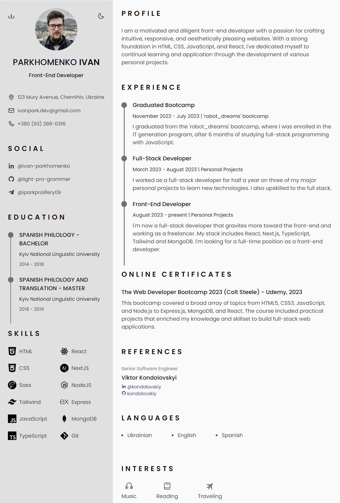

# Responsive Resume CV

This is a personal website for Ivan Parkhomenko, detailing his professional resume, skills, experiences, education, and more. The site is designed to be responsive, and showcases a modern approach to web design.

## Features

- Responsive web design ensuring compatibility across devices.
- Interactive navigation for different sections.
- Theme change button for personal preference.
- Option to generate and download CV in PDF format.
- Contact and social links for direct connection.
- Comprehensive detailing of skills, experiences, and references.

## Project Structure

├── assets/
│ ├── css/
│ │ └── styles.css
│ ├── img/
│ ├── js/
│ │ ├── html2pdf.bundle.min.js
│ │ └── main.js
│ └── pdf/
├── index.html
└── README.md

## Getting Started

1. Clone this repository.
2. Open `index.html` in your preferred browser.
3. Navigate through the different sections using the header navigation.

## External Libraries and Plugins

- [Box Icons](https://cdn.jsdelivr.net/npm/boxicons@latest/css/boxicons.min.css) - For various icons used throughout the site.
- [html2pdf](assets/js/html2pdf.bundle.min.js) - To generate a downloadable PDF of the resume.

## License

This project is open source and available for anyone to use. Please attribute the work to Ivan Parkhomenko and provide a link back to this repository if you use it in your projects.

## Connect with Me

- [LinkedIn](https://www.linkedin.com/in/ivan-parkhomenko-ab0027178/)
- [GitHub](https://github.com/light-pro-grammer)
- [Telegram](https://t.me/iparkprolifery09)
